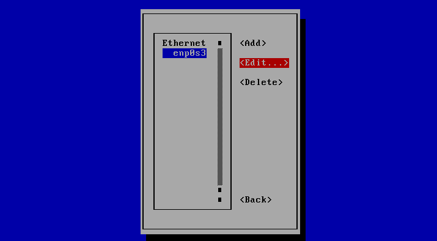
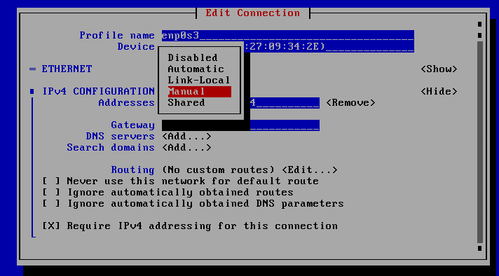
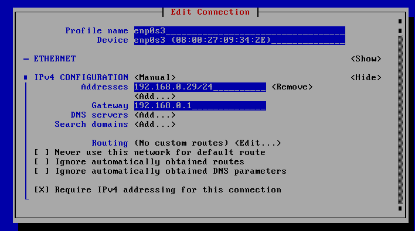
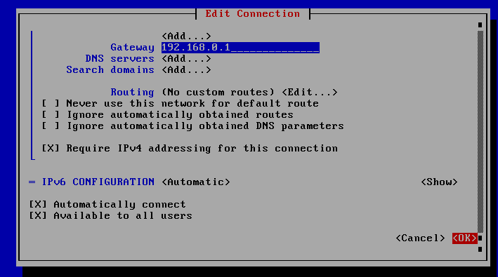

# NETWORK

you can use 2 ways edit network settings
* NMTUI (NetworkManager TUI)
* edit file /etc/sysconfig/network-scripts/ifcfg-enp0s3 <-- config file
	- enp0s3 my interface, your can diff
***

## Description
1. ### NMTUI (NetworkManger TUI)
	* edit a connection
	  
	* <choose your interface> and press <Edit ...>
	
	* IPv4 CONFIGURATION: choose your
		- if "automatic" scroll down and press <OK> 
		  
		- else edit settings scroll down and press <OK>  
		  
	* press <Back ...>  
	  
	* press <Quit ...>  
	  

#
2. ### edit config file
	* stop NetworkManger.service
	* nano vi "config file"
	* edit config file(my config is manual)  
		- add:  
			DEVICE=enp0s3  
			ONBOOT=yes  
			IPADDR=192.168.0.29  
			PREFIX=24  
			GATEWAY=192.168.0.1  
	* sudo systemctl restart NetworkManager.service
